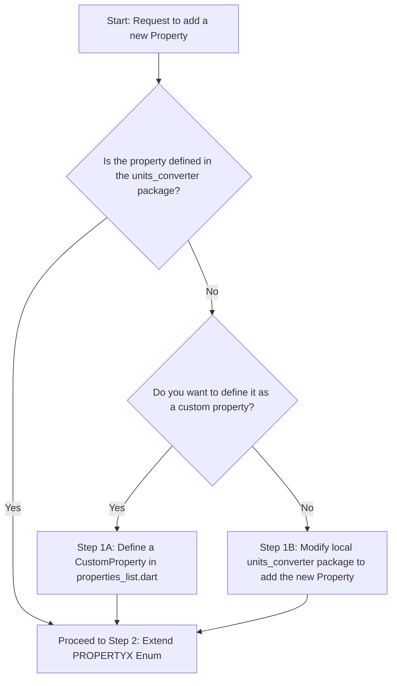

# Skill: Adding a New Measurement Property

This skill outlines the step-by-step process for adding a brand new measurement property (like radiation, illuminance, torque, etc.) to the **Converter NOW** application.

---

## Decision Tree: How to approach adding a property

Use this decision tree to determine the right path for your work:



---

## Step 1: Update the Property Conversion Logic

Depending on the decision tree, choose the appropriate sub-step:

### Step 1A: Defining a Custom Property
If defining the property directly in `ConverterNOW` without updating `units_converter`:
1. Use the `SimpleCustomProperty` or `CustomProperty` class in `units_converter`.
2. Define its conversion coefficients map dynamically.

### Step 1B: Modifying the `units_converter` Repository
If the property class and its unit enums need to be added directly to the `units_converter` package:
1. Clone/fork `units_converter`.
2. Create the new property class extending `Property` and its unit enums.
3. Reference this local copy in `ConverterNOW`'s `pubspec.yaml` under `dependency_overrides`.
4. Run `melos bootstrap`.

---

## Step 2: Extend the `PROPERTYX` Enum

1. Open [utils.dart](/lib/utils/utils.dart).
2. Locate `enum PROPERTYX`.
3. Add the camelCase name of your new property to the enum:
   ```dart
   enum PROPERTYX {
     // ...
     myNewProperty,
   }
   ```

---

## Step 3: Add to Default Layout Order

1. Open [default_order.dart](/lib/data/default_order.dart).
2. Add `PROPERTYX.myNewProperty` to the `defaultPropertiesOrder` list to set its display position in the main menu drawer.
3. Add an entry to the `defaultUnitsOrder` map, detailing the default display ordering of the unit enums of your new property:
   ```dart
   const Map<PROPERTYX, List<dynamic>> defaultUnitsOrder = {
     // ...
     PROPERTYX.myNewProperty: [
       MY_NEW_PROPERTY.unitA,
       MY_NEW_PROPERTY.unitB,
     ],
   };
   ```

---

## Step 4: Map UI Configurations & Icons

1. **Map Property UI Details**:
   Open [property_unit_maps.dart](/lib/data/property_unit_maps.dart). Locate `getPropertyUiMap`. Ensure your new property is mapped to its localization getter:
   ```dart
   PROPERTYX.myNewProperty: l10n.myNewProperty,
   ```

2. **Map Unit UI Details**:
   In the same file, locate `getUnitUiMap` and map your new property's unit enums to their localization getters:
   ```dart
   PROPERTYX.myNewProperty: {
     MY_NEW_PROPERTY.unitA: l10n.unitA,
     MY_NEW_PROPERTY.unitB: l10n.unitB,
   },
   ```

3. **Register Property Class**:
   Open [properties_list.dart](/lib/models/properties_list.dart). Locate the `propertiesMapProvider` map and add the class instantiation:
   ```dart
   PROPERTYX.myNewProperty: MyNewPropertyClass(
     significantFigures: significantFigures,
     removeTrailingZeros: removeTrailingZeros,
     name: PROPERTYX.myNewProperty,
   ),
   ```

4. **Add Graphic Icons**:
   Put the SVG icon files for the new property in `assets/property_icons/`:
   - `assets/property_icons/myNewProperty.svg` (Outline icon)
   - `assets/property_icons/myNewProperty_filled.svg` (Filled/Active icon)
   
   Run the compilation script via Melos to automatically generate the `.svg.vec` compiled formats in `assets/property_icons_opti/`:
   ```bash
   melos run compile_icons
   ```

---

## Step 5: Add Localized Translations

To support multi-language localizations, follow this translation workflow:

1. **Add English Template**:
   Open [app_en.arb](/packages/translations/lib/l10n/app_en.arb). Add the translation keys and English display names:
   ```json
   "myNewProperty": "My New Property",
   "unitA": "Unit A",
   "unitB": "Unit B"
   ```

2. **Add Untranslated Fallbacks for Other Languages**:
   For **every** other language `.arb` file in [l10n](/packages/translations/lib/l10n), add the translation keys with the **English value**, and add metadata comment blocks prefixed with `@` marking them as untranslated:
   ```json
   "myNewProperty": "My New Property",
   "@myNewProperty": {
     "description": "Not yet translated. Once done, remove this comment"
   },
   "unitA": "Unit A",
   "@unitA": {
     "description": "Not yet translated. Once done, remove this comment"
   },
   "unitB": "Unit B",
   "@unitB": {
     "description": "Not yet translated. Once done, remove this comment"
   }
   ```
   > [!IMPORTANT]
   > Do not try to translate the property/units to other languages yourself unless explicitly requested. Always mark other languages with the exact template block above.

3. **Regenerate Localization Files**:
   Run the localization script:
   ```bash
   melos run generate_translations
   ```

---

## Step 6: Verification

To verify that the new property works:

1. **Run Integration Tests**:
   Execute the integration tests from the root of the project to check if the UI layout and state management work without errors:
   ```bash
   flutter test integration_test/large_display_test.dart
   ```
