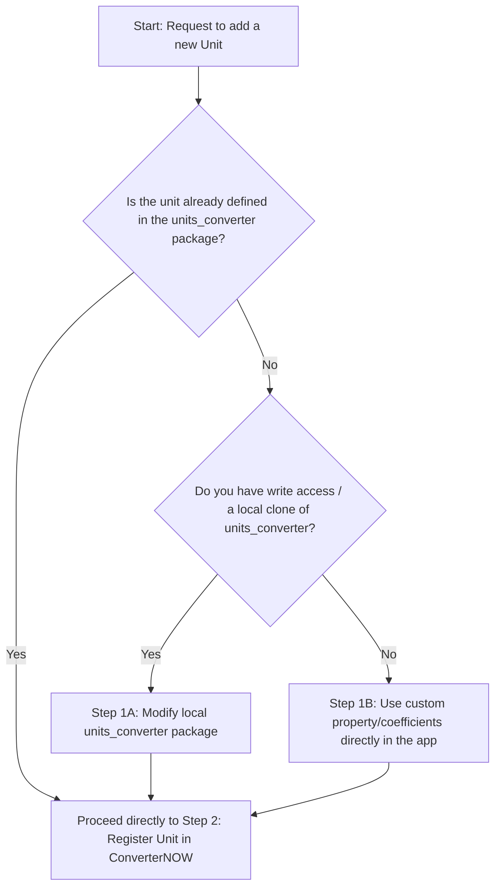

# Skill: Adding a New Measurement Unit

This skill outlines the step-by-step process for adding a new measurement unit to an existing property in the **Converter NOW** application.

---

## Decision Tree: How to approach adding a unit

Use this decision tree to determine the right path for your work:



---

## Step 1: Update the Unit Conversion Logic

Depending on the decision tree, choose the appropriate sub-step:

### Step 1A: Modifying the `units_converter` Repository
If the unit needs to be added directly to the underlying `units_converter` package:
1. Locate the package or its clone.
2. Add the unit enum value to the relevant property enum (e.g., `LENGTH`, `MASS`, `VOLUME`).
3. Add the conversion rate relative to the base unit in the respective property class.
4. In `ConverterNOW`'s `pubspec.yaml`, override the `units_converter` package to point to your local version if it is not yet published:
   ```yaml
   dependency_overrides:
     units_converter:
       path: ../path/to/local/units_converter
   ```
5. Run the melos bootstrap command to update workspace dependencies:
   ```bash
   melos bootstrap
   ```

### Step 1B: Using Custom App-Level Conversions
If the unit is added via a custom property or dynamically in the app (e.g., Currencies or custom defined classes), update the specific map instantiation in [properties_list.dart](/lib/models/properties_list.dart).

---

## Step 2: Register the Unit in `ConverterNOW`

Once the unit exists in `units_converter` or is available dynamically:

1. **Update Default Order**:
   Open [default_order.dart](/lib/data/default_order.dart) and locate the `defaultUnitsOrder` map. Add your newly added unit enum value to the list under the correct `PROPERTYX` category. This ensures the unit appears in the user's conversion screen in the correct default position.

2. **Map the Unit UI Label**:
   Open [property_unit_maps.dart](/lib/data/property_unit_maps.dart) and locate `getUnitUiMap(BuildContext context)`. Add the mapping from the enum value to the localized translation string:
   ```dart
   PROPERTYX.length: {
     // ...
     LENGTH.myNewUnit: l10n.myNewUnit,
   }
   ```

---

## Step 3: Add Localized Translations

To support multi-language localizations, follow this precise translation workflow:

1. **Add English Template**:
   Open the base translation file [app_en.arb](/packages/translations/lib/l10n/app_en.arb). Add the translation key and English display name:
   ```json
   "myNewUnit": "My New Unit"
   ```

2. **Add Untranslated Fallbacks for Other Languages**:
   For **every** other language `.arb` file in [l10n](/packages/translations/lib/l10n) (e.g., `app_it.arb`, `app_nb.arb`, `app_fr.arb`, etc.), add the key with the **English value**, and add a metadata comment block prefixed with `@` marking it as untranslated:
   ```json
   "myNewUnit": "My New Unit",
   "@myNewUnit": {
     "description": "Not yet translated. Once done, remove this comment"
   }
   ```
   > [!IMPORTANT]
   > Do not try to translate the unit to other languages yourself unless explicitly requested. Always mark other languages with the exact template block above.

3. **Regenerate Dart Localization Files**:
   Run the translation generator script via Melos. First, run it with `--help` or check its usage if needed, or simply run the bootstrap/generation hook:
   ```bash
   melos run generate_translations
   ```
   > [!TIP]
   > Treating this script as a black box keeps your context clean. It executes `flutter gen-l10n` inside the `translations` package.

---

## Step 4: Verification

To verify that the new unit works and the project still compiles perfectly:

1. **Run Integration Tests**:
   Execute the integration tests from the root of the project to check if the UI layout and state management work without errors:
   ```bash
   flutter test integration_test/large_display_test.dart
   ```
2. **Compile Vector Graphics**:
   Ensure all icons and graphics are correctly optimized and compiled:
   ```bash
   melos run compile_icons
   ```
