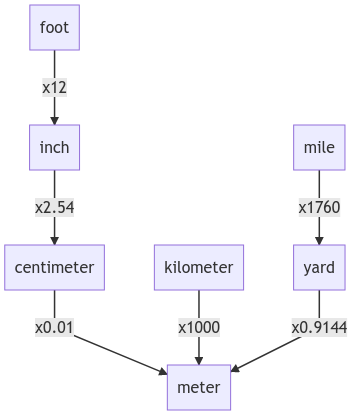

# Welcome

We invite you to join our team! Everyone is welcome to contribute code via pull requests and filing issues on GitHub. You can contribute in different ways, do you think you are not capable to contribute? I will proove you are wrong. Let's get started!

## Translating the app

Right now the app is translated in english, italian, portoguese, french, norwegian and german. If you know other languages and wants to help internationalizing take a look at the most updated instruction [here](https://github.com/ferraridamiano/ConverterNOW/issues/2). Than, if you want you can also translate the PlayStore/F-droid app page. You can find the page to translate [here](https://github.com/ferraridamiano/ConverterNOW/tree/master/fastlane/metadata/android/en-US). If you have some question please contact me via e-mail or submit a new issue. That's all, I will take care of the rest. Thank you!

## Design a new logo

If you think you are able to do a better app icon you are welcome to open a new issue with your proposal. Than I can tell you how you can merge you idea to this project. Thank you!

## Submit a PR

If you feel confident with flutter coding, you can help me improving this app by submitting a PR. But first, let me explain you how this project is organized.

### Project structure

The project uses [provider](https://github.com/rrousselGit/provider) for state management and it helps separate UI from the model. Right now the models are two: [AppModel.dart](https://github.com/ferraridamiano/ConverterNOW/blob/master/lib/models/AppModel.dart) contains the basic logic of the app (which page is selected, in which order, etc.) and [Conversions.dart](https://github.com/ferraridamiano/ConverterNOW/blob/master/lib/models/Conversions.dart) contains the logic of the conversion section (retrive currencies rates from internet, in which order are the unit of measurement, etc.). You might say: "Why don't you just made one model?", the answer is: because I plan to make also a [tools section](https://github.com/ferraridamiano/ConverterNOW/issues/6) and so it is more organized.

### Conversion algorithm

I imagined a conversion as a tree graph. Here I reported part of the graph of the length conversion:

As you can see, all units depends by other units by 1 (or more) costant. Most of the conversion between two units x and y can be done with one of these structures:

The first one is the most common linear conversion (the costant help with faraday-celsius conversion). The second one is used in fuel conversion like   to .

It can also be defined other types of custom conversion such between different numeral system (bynary-octal-decimal-exadecimal).

Once a *textFormField* is selected the unit node in the graph has the property *selectedNode* equals to true (and all other *selectedNode* in every other node are marked as false). When the user changes the value of the *textFormField* the conversion propagates from the node which the user has interact with to all other nodes. Once a node is converted the *convertedNode* property of the node is setted to true.

## What if I am too lazy?

You should exit from your comfort zone and try what does it feel to submit a PR and merge it to an open source project! When you do it you feel like a little bit of this project is also yours and all the people that uses this app will enjoy your contributions! But if you are too too lazy you can contributing with a small [paypal donation](https://www.paypal.com/paypalme/DemApps) to let the developer feels your interest. Thank you!

