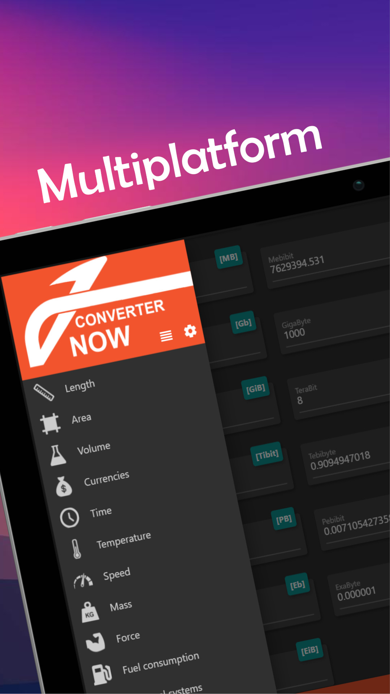

# Converter NOW

    

## Why Converter NOW

Converter NOW is an effective unit and currency converter

🚀 It is made to be **easy**, **fast** and **immediately** useable: just start typing and immediately you have the real-time conversion  with all the other units of measurement

🖌️ It is **customizable**: the units can be reorganized according to your priorities and your use case

🔢 It integrates a **Calculator** that let you do the calculations in every page

💰 Currency conversions are **updated daily**

⚫⚪ **Choose your favourite theme**: dark or white theme

📱🖥️ **Full Smartphone, Tablet and Web app support**

💯 It is **free**, **no ads**, **no analytics**, **no permissions** (just Internet to update currency conversions). And first of all it is **open source**!

## Why I made Converter NOW

A few years ago I noticed that most of the unit converters on the digital stores were ugly, not immediately usable, with tons of useless tools. I thought it would be a  good idea to develop a unit converter app that solve all this problems.

That year (2018) I first heard of Flutter. It still was in beta, but I decided to build it with this modern framework anyway, just to learn more. My friend Giovanni made the app logo for me and I launched it on the Play Store.

The project is not well structured. I made it to learn more about programming. **It is not perfect but I hope that with your help we can improve it!**

How can you improve it? Just star the repo and take a look at [contributing file](https://github.com/ferraridamiano/ConverterNOW/blob/master/CONTRIBUTING.md).

## Installation
You can either install this app from the main app stores or compile it from the source code.

**If you want to directly install this app for your platform check the direct links at the top of this README**.

If you choose the second option you have first to [install flutter](https://docs.flutter.dev/get-started/install) and have all the tools specific for the target platform (e.g. Android studio for Android, Visual Studio for Windows etc.). Make sure everything is right with  `flutter doctor`. Then, clone this project and `cd` to the directory. Type `flutter pub get` to get all the dependencies and generate the code for the translations.

### Android
First, you have to disable the signing option in [`android/app/build.gradle`](https://github.com/ferraridamiano/ConverterNOW/blob/master/android/app/build.gradle#L70) (just comment that line). Then you can type `flutter build apk --split-per-abi` to compile the code. You can find the output in `build/app/outputs/apk/release` folder.

### Linux
Type `flutter build linux` to compile the code. You can find the output in `build/linux/x64/release/bundle`.

### Windows
A compiled installer for Windows is already availavble in the [release section](https://github.com/ferraridamiano/ConverterNOW/releases).

Otherwise, type `flutter build windows` to compile the code. You can find the output in `build/windows/runner/Release`.

### Web
Type `flutter build web` to compile the code. You can find the output in `build/web`.

### Other platforms
You should be able to run this app also on iOS and MacOS, however I've not tested it. You can try and let me know.
