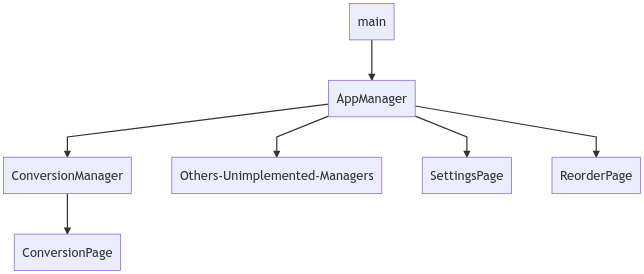

# Converter NOW

### Why Converter NOW

Converter NOW is an effective unit and currencies converter

🚀 It is made to be **easy**, **fast** and **immediate** to use: just start typing and immediately you have the real-time conversion  with all the other units of measurement

🖌️ It is **customizable**: the units can be reorganized according to your priorities and your use

🔢 It integrates a **Calculator** that let you do the calculations in every page

💰 Currencies conversions are **daily updated**

⚫⚪ **Choose your favourite theme**: dark and white theme

📱🖥️ **Full Smartphone, Tablet and Web app support**

💯 It is **free**, **no ads**, **no analytics**, **no permission** (just internet to update currencies conversions). And first of all it is **open source**!

🔗 [Play Store link](https://play.google.com/store/apps/details?id=com.ferrarid.converterpro)

🔗 [Web App link](https://ferraridamiano.github.io/ConverterNOW/)

### Screenshots

   

The upper 4 screenshots show the main screen of the app on an android phone. The screenshot below shows how easy the app adapts on large screens in a PWA.

### Why I made Converter NOW

Few years ago I noticed that most of the unit converters on the digital stores were ugly, not immediate to be used, with tons of useless tools. I tought it would be a  good idea to develope a unit converter app that solve all this problems.

That year (2018) I first heard of Flutter, it still was in beta, but I decided to build it with this modern framework anyway, just to learn more. My friend Giovanni made the app logo for me and I launched it on the Play Store.

The project is not well structured. I made it to learn more on programming. **It is not perfect but I hope that with your help we can improve it!**

How can you improve it? Open issues (or feature requests), send pull requests, fork, star, share, donate to this project. Or you can just tell me this app is useful for you. 

### Structure of the project

### Conversion algorithm

I imagined a conversion as a tree graph. Here I reported part of the graph of the length conversion:

As you can see, all units depends by other units by 1 (or more) costant. Most of the conversion between two units x and y can be done with one of these structures:

The first one is the most common linear conversion (the costant help with faraday-celsius conversion). The second one is used in fuel conversion like km/l  to l/100 km.

It can also be defined other types of custom conversion such between different numeral system (bynary-octal-decimal-exadecimal).

Once a *textFormField* is selected the unit node in the graph has the property *selectedNode* equals to true (and all other *selectedNode* in every other node are marked as false). When the user changes the value of the *textFormField* the conversion propagates from the node which the user has interact with to all other nodes. Once a node is converted the *convertedNode* property of the node is setted to true.
