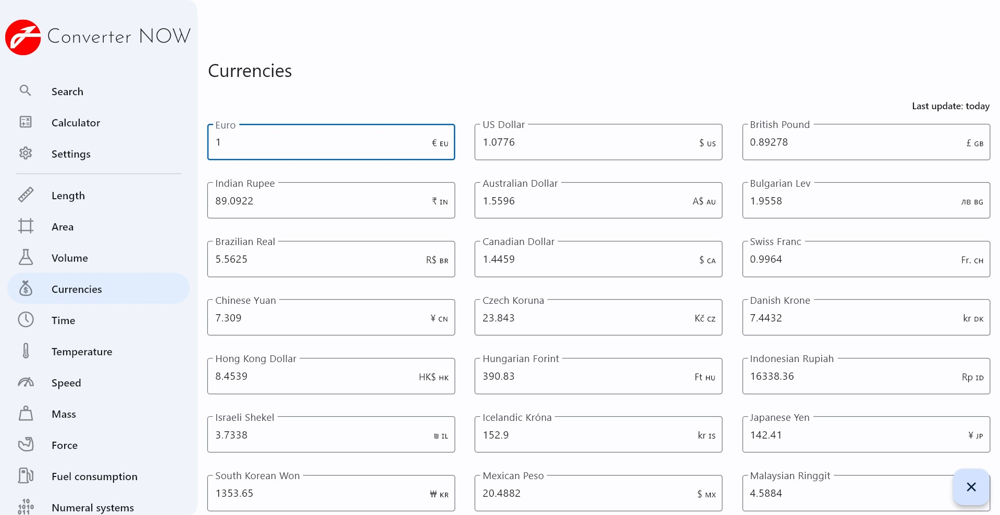
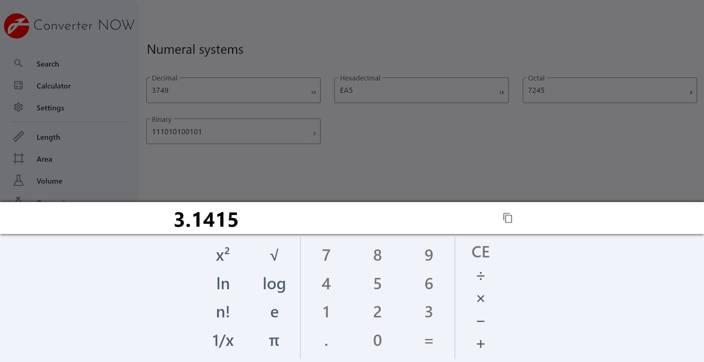
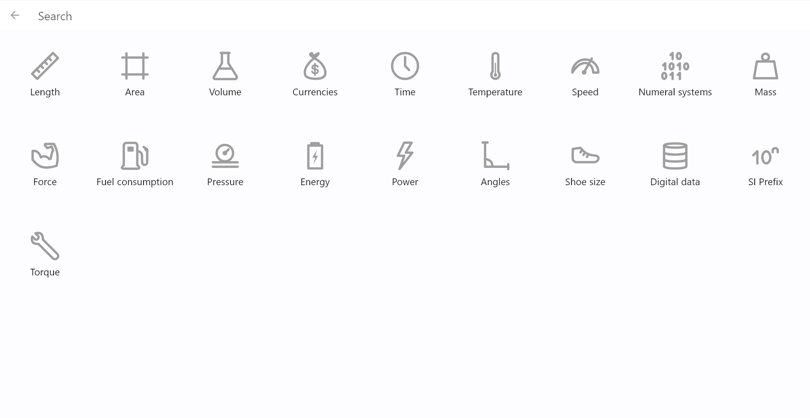
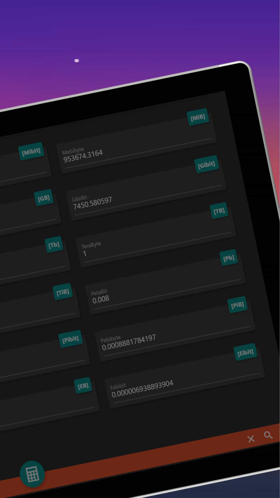

# Converter NOW

    

## Why Converter NOW

Converter NOW is an effective unit and currencies converter

🚀 It is made to be **easy**, **fast** and **immediate** to use: just start typing and immediately you have the real-time conversion  with all the other units of measurement

🖌️ It is **customizable**: the units can be reorganized according to your priorities and your use

🔢 It integrates a **Calculator** that let you do the calculations in every page

💰 Currencies conversions are **daily updated**

⚫⚪ **Choose your favourite theme**: dark and white theme

📱🖥️ **Full Smartphone, Tablet and Web app support**

💯 It is **free**, **no ads**, **no analytics**, **no permission** (just internet to update currencies conversions). And first of all it is **open source**!

## Why I made Converter NOW

Few years ago I noticed that most of the unit converters on the digital stores were ugly, not immediate to be used, with tons of useless tools. I tought it would be a  good idea to develop a unit converter app that solve all this problems.

That year (2018) I first heard of Flutter, it still was in beta, but I decided to build it with this modern framework anyway, just to learn more. My friend Giovanni made the app logo for me and I launched it on the Play Store.

The project is not well structured. I made it to learn more on programming. **It is not perfect but I hope that with your help we can improve it!**

How can you improve it? Just star the repo and take a look at [contributing file](https://github.com/ferraridamiano/ConverterNOW/blob/master/CONTRIBUTING.md).
