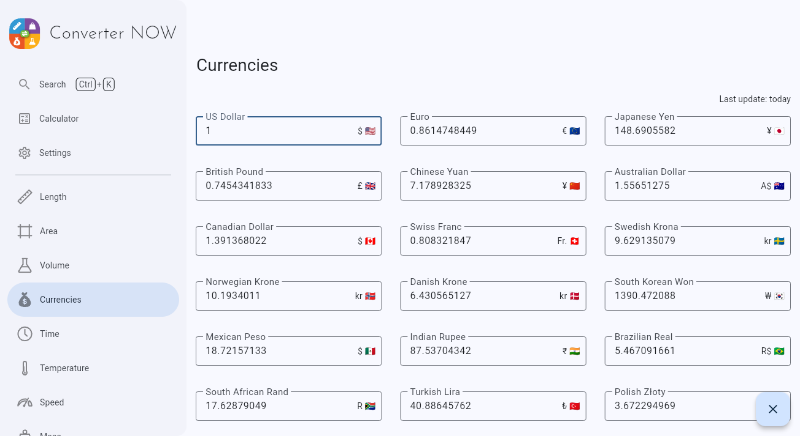

<div align="center">

# Converter NOW

</div>

<div align="center">
    
</div>

<br/>

<div align="center">
  <a href="https://play.google.com/store/apps/details?id=com.ferrarid.converterpro">
    
  </a>
  <a href="https://www.microsoft.com/store/apps/9P0Q79HWJH72">
    
  </a>
  <a href="https://flathub.org/apps/details/io.github.ferraridamiano.ConverterNOW">
    
  </a>
  <a href="https://github.com/ferraridamiano/ConverterNOW/releases">
    
  </a>
  <a href="https://f-droid.org/packages/com.ferrarid.converterpro">
    
  </a>
  <a href="https://github.com/ferraridamiano/ConverterNOW/releases/latest">
    
  </a>
  <a href="https://converter-now.web.app">
    
  </a>
</div>

<br/>

<div align="center">
  
</div>

## Why Converter NOW

Tired of complicated, cluttered, and ad-filled unit converters? Converter NOW
is your perfect solution! A few years ago, we realized that most unit
converters were not only visually unappealing but also lacked functionality,
privacy, and ease of use. So, we created Converter NOW to change that!

🚀 **Fast & Intuitive**: Experience lightning-fast, real-time conversions as
soon as you start typing. No more navigating through confusing menus – just
instant results with all measurement units!

🛠️ **Fully Customizable**: Tailor your experience by reorganizing units based
on your preferences and priorities. Make Converter NOW truly yours!

🔢 **Built-in Calculator**: Perform complex calculations effortlessly on any
page. No need to switch between apps – it's all integrated seamlessly.

💱 **Daily Currency Exchange Updates**: Stay up-to-date with accurate, real-time
currency conversions updated daily, perfect for travelers and global
professionals.

🎨 **Personalize Your Style**: Choose your favorite accent color, matching your
device's theme or your unique style preferences.

⚫⚪ **Light & Dark Modes**: Switch between dark and light themes for a
comfortable experience, day or night.

📱🖥️ **Cross-Platform Support**: Enjoy Converter NOW on Android, Web, Linux, and
Windows. Whether you're on your phone or desktop, we've got you covered!

💯 **Completely Free**: No ads, no data collection, and no intrusive permissions
(just internet access for currency updates). Best of all, it's
**100% open source!**

## Alternative installation sources

### Winget

Run the following command:
```bash
winget install -e 9P0Q79HWJH72
```

### Docker self-hosted web app

Run the following command:
```bash
docker run -d -p 80:80 ghcr.io/ferraridamiano/converternow:latest
```
Then, you can access it via browser on `localhost:80`

## Build from source code
First you need to
[install flutter](https://docs.flutter.dev/get-started/install) and all the
tooling for your target platform (e.g. Android Studio for Android, etc.). Then you have to install two tools:

- `dart pub global activate melos` (useful to easily manage the repository)
- `dart pub global activate vector_graphics_compiler` (useful to compile the `svg` icons)

Then, run `melos bootstrap` in the root of the project in order to get all the dependencies, generate the
translation files and optimize the `svg` icons. Then follow the instructions for the platform you want to target.

### Android
On Android you should first disable the signing option in
[`android/app/build.gradle`](https://github.com/ferraridamiano/ConverterNOW/blob/master/android/app/build.gradle#L57)
Then you can type `flutter build apk --split-per-abi` to compile the code. You
can find the output in `build/app/outputs/flutter-apk` folder.

### Linux
Type `flutter build linux` to build the Linux app. You can find the output in
`build/linux/x64/release/bundle`.

### Windows
Type `flutter build windows` to build the Windows app. You can find the output
in `build/windows/runner/Release`.

### Web
Type `flutter build web` to build the Web app. You can find the output in
`build/web`.

Note: if you deploy it not on the base path, add `--base-href=/path/` to the command above, change `/path/` with your path.

### Web app on Docker
You can build the Docker image of Converter NOW in your environment with the
following command:
```shell
docker buildx build -t converternow .
```

Then, run the docker container:
```shell
docker run -d -p 80:80 converternow
```

You can access it via browser at `localhost:80`

### iOS and MacOS
The app is not tested against iOS and MacOS, but you should be able to compile
it even for these platforms. You first need to generate the platform specific
code and then compile them.
